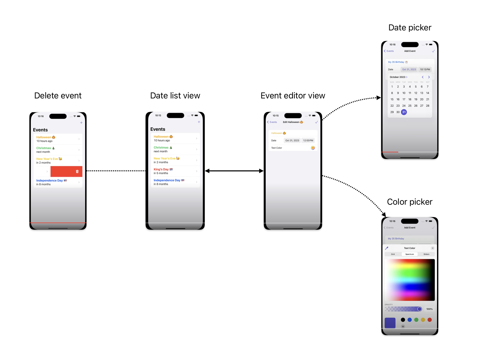

# iOS-projects

## Todo App
A commandline prototype tool to record todos. 

Functionality:
1. Automatic store changes in local file system
2. `add`, `toggle`, `list`, and `delete` a todo

## Event Countdown App

Storyline of the design guide: 

